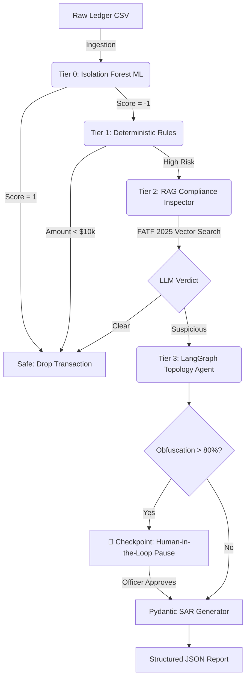

# 🛡️ Fintech Fraud Auditor Pro: Agentic AML Engine

An enterprise-grade, multi-tiered Anti-Money Laundering (AML) forensic platform. This architecture solves the primary bottleneck of Generative AI in financial services—cost and latency—by utilizing a statistical Machine Learning funnel to protect expensive LLM orchestration layers.

## 🏗️ Architecture: The Risk Funnel

Passing raw transaction streams directly to an LLM is an anti-pattern. This system implements a strict "Tiered Risk Funnel" to optimize compute costs and minimize API limits.

🧠 The Tiers Explained

    Tier 0 (Statistical ML): An Unsupervised IsolationForest processes raw transactions in milliseconds. It mathematically drops statistically normal volume, forwarding only anomalies (saving ~80% in LLM API costs).

    Tier 1 (Deterministic): Hard-coded Python/Pandas logic filters for strict jurisdictional and financial thresholds.

    Tier 2 (Vector RAG): Suspicious transactions are grounded against FATF 2025 guidelines using a Qdrant Vector Database to prevent LLM hallucination on legal definitions.

    Tier 3 (Stateful Orchestration): A LangGraph agent traverses transaction history to calculate topological risk (circular smurfing, network velocity).

🚀 Key Enterprise Features

    Stateful Human-in-the-Loop (HITL): Utilizes LangGraph's MemorySaver to physically pause code execution when critical obfuscation is detected, requiring asynchronous human authorization to proceed.

    Deterministic Output Contracts: Bypasses standard text generation by enforcing strict Pydantic schemas via Vertex AI, guaranteeing downstream systems receive perfectly structured JSON Suspicious Activity Reports (SARs).

    Algorithmic Watchlist Screening: Replaced LLM prompting for OFAC/PEP sanctions screening with deterministic fuzzy matching (rapidfuzz Levenshtein distance), eliminating hallucination risk for critical compliance directives.

🛠️ Tech Stack

    AI & Orchestration: Google Vertex AI (Gemini Flash), LangGraph, LangChain

    Machine Learning: Scikit-Learn (Isolation Forest)

    Vector Database: Qdrant (Local/In-Memory)

    Data Engineering: Pandas, Pydantic, RapidFuzz

    Frontend Prototype: Streamlit

💻 Local Setup

1.Clone the repository and configure the virtual environment:

Bash

git clone [https://github.com/yourusername/fintech-fraud-auditor.git](https://github.com/yourusername/fintech-fraud-auditor.git)
cd fintech-fraud-auditor
python -m venv .venv
source .venv/bin/activate  # On Windows use: .venv\Scripts\activate

2.Install dependencies:

Bash

pip install -r requirements.txt

3.Configure environment variables in a .env file:

Code snippet

GOOGLE_API_KEY=your_vertex_or_gemini_key

4.Initialize the platform:

Bash

streamlit run app.py

🛣️ Production Roadmap

Note: This repository currently serves as a functional, synchronized prototype. The V2 enterprise architecture migration is planned as follows:

    [ ] Decoupled Backend: Migrate synchronous Streamlit logic to an asynchronous FastAPI REST backend.

    [ ] Message Queues: Implement Celery/Redis to handle heavy LangGraph topology traversal asynchronously, preventing thread-blocking during large batch audits.

    [ ] Persistent State: Upgrade LangGraph's in-memory Checkpointer to PostgreSQL for durable HITL pauses.

    [ ] Frontend: Rewrite UI layer in Next.js/React.
